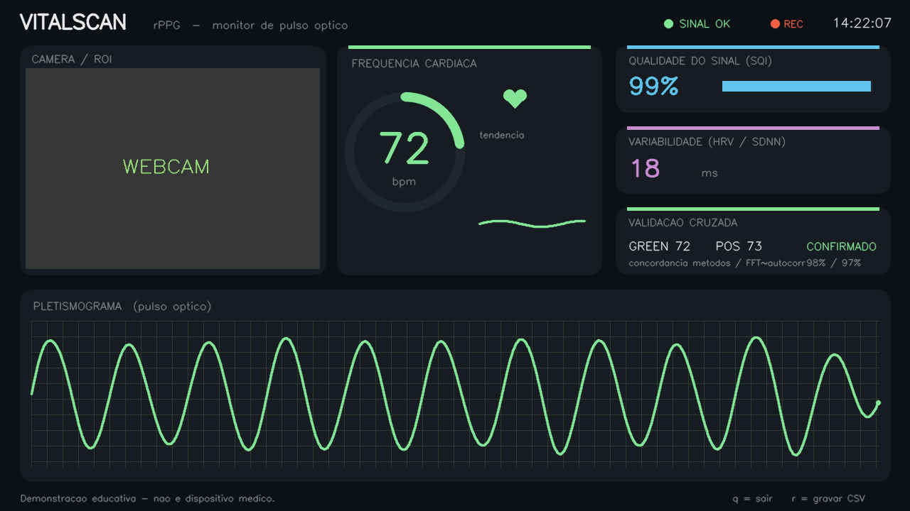

# 💓 Batimentos pela Pele — rPPG em Python

Mede a **frequência cardíaca pela webcam**, sem nenhum sensor de contato, detectando
a variação sutil da cor da pele a cada batimento (**fotopletismografia remota — rPPG**).

A versão principal (`rppg_pos.py`) implementa o algoritmo **POS**
(*Plane-Orthogonal-to-Skin*, Wang et al., IEEE TBME 2017) e exibe os resultados
numa interface no estilo de **monitor de sinais vitais hospitalar**.



## Recursos

### Precisão & validação
- **Ensemble de algoritmos** — **POS** (Wang 2017) + **CHROM** (de Haan 2013) +
  canal verde, fundidos por peso de SNR.
- **Validação cruzada** — concordância entre os dois métodos de maior SNR.
- **Verificação independente** — HR por **autocorrelação** confrontado com a FFT.
- **Interpolação parabólica do pico** — precisão de BPM abaixo da resolução do bin.
- **Máscara de pele (YCrCb)** — média só sobre pixels de pele dentro das ROIs.
- **Múltiplas ROIs** — testa + duas bochechas, combinadas.
- **Reamostragem uniforme** — corrige a amostragem irregular da webcam antes da FFT.
- **Rejeição de movimento** — descarta frames com salto brusco da ROI.
- **Suavização com rejeição de outliers** — mediana temporal + rastreamento da face (EMA).
- **SQI composto** — combina SNR + concordância de métodos + concordância FFT/autocorr.

### Interface (UI/UX comercial)
- Dashboard "VitalScan": cartões arredondados, anel de progresso da FC, coração
  pulsante, barra de qualidade, sparkline de tendência e painel de validação.
- **Métricas exibidas** — BPM, SQI (%), HRV (SDNN, ms) e status de validação.
- **Gravação CSV** — tecla `r` grava `t, bpm, snr, sqi, hrv, bpm_autocorr`.

## Instalação

```bash
pip3 install -r requirements.txt
```

## Uso

```bash
python3 rppg_pos.py        # versão científica + monitor médico
python3 batimentos_pele.py # versão simples (canal verde) p/ comparação
```

Teclas: **`q`** sai · **`r`** liga/desliga a gravação CSV.

Mantenha o rosto bem iluminado e relativamente parado por ~8 s para a leitura estabilizar.

## Arquivos

| Arquivo | Descrição |
|---|---|
| `rppg_pos.py` | Versão principal: POS + monitor médico |
| `batimentos_pele.py` | Versão simples (média do canal verde) |
| `roteiro_reels.md` | Roteiro de vídeo (Reels/TikTok) do projeto |
| `requirements.txt` | Dependências |

## ⚠️ Aviso

Demonstração **educativa**. **Não é um dispositivo médico** e não deve ser usado
para diagnóstico ou decisões de saúde.

## Licença

MIT
